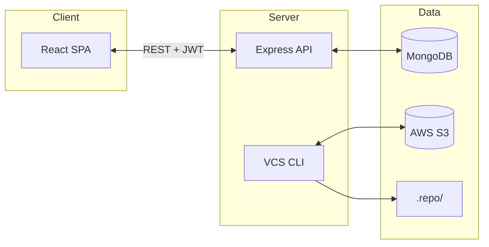
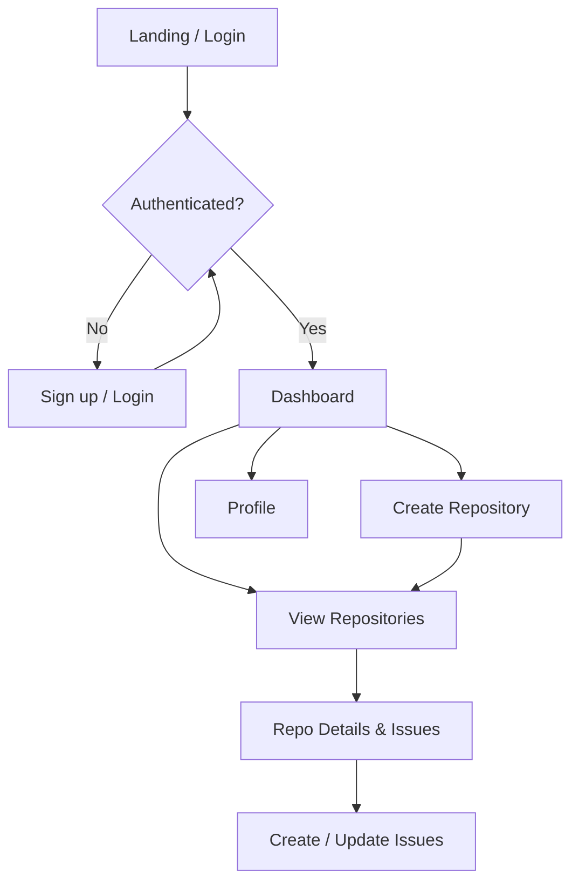
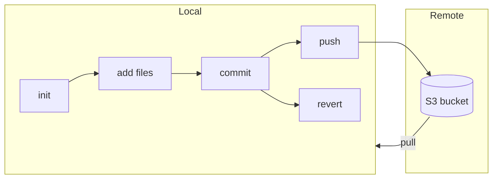

# GitHub Clone

A full-stack **MERN** (MongoDB, Express, React, Node.js) application that replicates core GitHub-like features with a **custom version control system** implemented from scratch. Users can sign up, create repositories, manage issues, and use a CLI for init, add, commit, push, pull, and revert—with cloud storage via AWS S3.

**Author:** Aditya Paneru

---

## Tech Stack

| Layer      | Stack |
|-----------|--------|
| Frontend  | React 18, Vite, React Router, Primer React, Axios |
| Backend   | Node.js, Express, Mongoose |
| Database  | MongoDB |
| Storage   | AWS S3 (for commit/artifact storage) |
| Auth      | JWT, bcrypt |

---

## How it works

### System architecture

The app is a MERN stack with a custom VCS. The frontend talks to the Express API; the API uses MongoDB for users, repos, and issues; and the CLI stores commits locally in `.repo/` and can sync them with AWS S3.



### User workflow (web app)

Users sign up or log in, then use the dashboard to create repositories and manage issues. Profile shows user info and contribution-style data.



### Custom VCS workflow (CLI)

The version control flow mirrors git: initialize a repo, stage files, commit, then push to S3 or pull from it. Revert restores the working directory to a chosen commit.



---

## Project Structure

```
Github-1/
├── backend-main/          # Node.js API + custom VCS CLI
│   ├── config/            # AWS and app config
│   ├── controllers/       # init, add, commit, push, pull, revert, repos, users, issues
│   ├── middleware/        # auth, authorization
│   ├── models/            # User, Repo, Issue
│   ├── routes/            # REST API routes
│   └── index.js           # Server entry + yargs CLI
├── frontend-main/         # React SPA
│   ├── src/
│   │   ├── components/    # auth, dashboard, user (Profile, HeatMap)
│   │   ├── authContext.jsx
│   │   ├── Routes.jsx
│   │   └── main.jsx
│   └── index.html
└── README.md
```

---

## Prerequisites

- **Node.js** (v18+ recommended)
- **MongoDB** (local or Atlas)
- **AWS account** (for S3 bucket; optional if only using local VCS)

---

## Workflow

### 1. Clone and install

```bash
git clone <your-repo-url>
cd Github-1
```

**Backend**

```bash
cd backend-main
npm install
```

**Frontend**

```bash
cd frontend-main
npm install
```

### 2. Environment variables

**Backend** (`backend-main/.env`):

```env
PORT=3000
MONGODB_URI=mongodb://localhost:27017/github-clone
# Optional: for push/pull to S3
S3_BUCKET=your-bucket-name
AWS_ACCESS_KEY_ID=your-access-key
AWS_SECRET_ACCESS_KEY=your-secret-key
```

**AWS config**  
Update `backend-main/config/aws-config.js` if you use a different bucket or region (e.g. set `S3_BUCKET` from env).

### 3. Run the app

**Terminal 1 – Backend (API + server)**

```bash
cd backend-main
npm start
```

Server runs at `http://localhost:3000` (or your `PORT`).

**Terminal 2 – Frontend (dev server)**

```bash
cd frontend-main
npm run dev
```

Open the URL shown (e.g. `http://localhost:5173`). You can sign up, log in, use the dashboard, create repos, and manage issues from the UI.

### 4. Custom version control (CLI)

The backend exposes a **git-like CLI** via `node index.js <command>`. Run these from the **backend-main** directory (or from any directory where you want a repo).

| Command | Description |
|--------|-------------|
| `node index.js init` | Create a new repository (creates `.repo` in current directory) |
| `node index.js add <file>` | Stage a file |
| `node index.js commit <message>` | Commit staged files |
| `node index.js push` | Upload commits to S3 |
| `node index.js pull` | Download commits from S3 |
| `node index.js revert <commitID>` | Revert working directory to a commit |

**Example workflow**

```bash
cd backend-main
node index.js start          # start API server (or use npm start)

# In another terminal, in a project folder:
cd /path/to/your-project
node /path/to/Github-1/backend-main/index.js init
node /path/to/Github-1/backend-main/index.js add package.json
node /path/to/Github-1/backend-main/index.js commit "Add package.json"
node /path/to/Github-1/backend-main/index.js push
```

Repositories are stored locally under `.repo/` (staging + commits). Push/pull use the S3 bucket configured in `config/aws-config.js` and env.

### 5. Build for production

**Frontend**

```bash
cd frontend-main
npm run build
```

Serve the `dist/` folder with any static host or point your backend to it.

---

## API overview

- **Auth:** signup, login (JWT).
- **Users:** profile, heatmap-style data.
- **Repos:** create, list, get by id.
- **Issues:** create, list, update (per repo).

Base URL: `http://localhost:3000` (or your `PORT`). Use the routes under `/` as defined in `backend-main/routes/`.

---

## License

ISC

**Author:** Aditya Paneru
